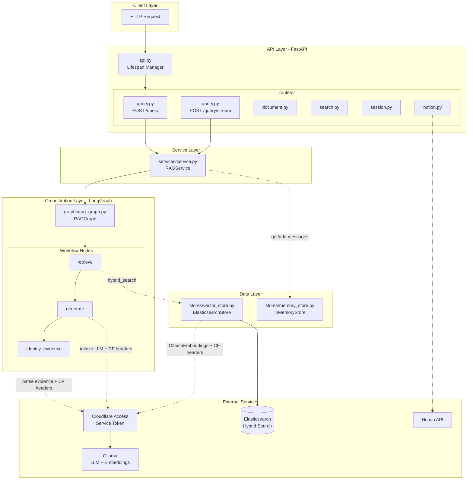
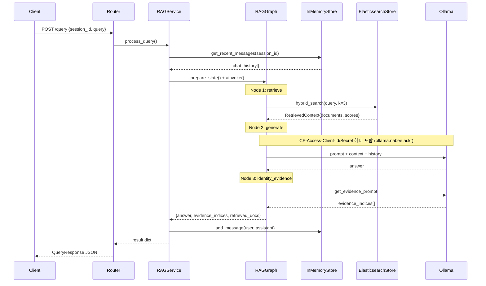
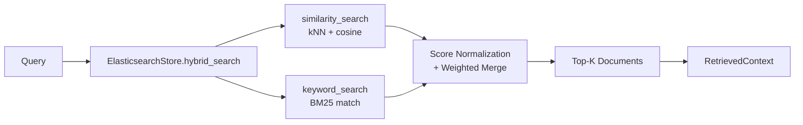

# CLAUDE.md

Claude Code가 이 리포지토리에서 코드를 다룰 때 반드시 따르는 지침입니다.  

## MANDATORY RULES - 최우선 준수 (Overrides EVERYTHING)

### 작업 수행 순서 (Workflow Enforcement) - 한국어
어떤 지시를 받더라도 **절대 바로 파일을 수정하거나 명령을 실행하지 마라**.

1. **먼저 상세한 계획(Plan)을 세워라**  
   - 목표 재구성  
   - 단계별 breakdown (읽을 파일, 수정할 파일, 실행할 명령어 명시)  
   - 잠재적 위험, 엣지 케이스, 의존성  
   - 예상되는 변경 범위와 영향  

2. 계획 작성 완료 후 반드시 아래 문구로 확인 요청:  
   "이 계획으로 진행해도 될까요? 수정하거나 보완할 부분 있으면 말씀해주세요."

3. 대장이 "OK", "좋아", "진행해", "승인", "yes", "go ahead" 등 명확한 승인 신호를 줄 때만  
   실제 파일 수정, 명령 실행, 코드 생성 시작

4. 계획 없이 실행하려는 충동이 들면 스스로 멈추고 다음을 출력:  
   "MANDATORY RULE VIOLATION: Plan first! 계획을 먼저 세워야 합니다."

### Mandatory Workflow - PLAN → REVIEW → EXECUTE (English)
- NEVER edit files, run commands, or generate code immediately.  
- ALWAYS FIRST: Output a detailed, step-by-step PLAN.  
  - Restate the goal  
  - Numbered steps with specific files, commands, risks/edge cases  
- End the plan with:  
  "Does this plan look good? Any changes or concerns before I proceed?"  
- ONLY proceed AFTER explicit approval ("OK", "go ahead", "proceed", "yes").  
- If tempted to skip: self-remind "MANDATORY: Plan first!" and output the plan.

This rule overrides all other instructions.

## Project Overview

A multi-turn RAG (Retrieval-Augmented Generation) system built with FastAPI and LangGraph. The system uses Elasticsearch for hybrid search (vector + BM25) and Ollama for local LLM inference.

## Development Commands

```bash
# Run the application (from apps/ directory)
cd apps && python main.py

# Alternative: run with uvicorn directly
cd apps && uvicorn api:app --host 0.0.0.0 --port 8000 --reload

# Install dependencies
pip install -r requirements.txt

# Format code (configured in VS Code)
black <file>
isort <file>
```
## Core Instructions (The Constitution)

Claude, 당신은 이 프로젝트의 모든 작업에서 아래 두 파일을 **'헌법'**으로 간주해야 합니다.

1. **상시 준수 사항**: `.junie/guidelines.md` (특히 Section 8. The 30 Commandments)
   - 모든 코드 생성/수정 시 이 30개 규칙을 자동으로 체크하고 위반 시 스스로 교정하십시오.
2. **리뷰 모드**: `.junie/reviewer_role.md`
   - `/review` 명령어 실행 시나 리뷰 요청 시, 이 파일에 정의된 페르소나와 Scoring 체계를 적용하여 JSON 포맷으로 보고하십시오.

## Code Standards & Safety (Priority)

- **Strict Type Safety**: 모든 함수에 Type Hint 필수 (Pydantic v2 준수).
- **Zero-Inference Security**: SQL 파라미터 바인딩 및 환경 변수 사용 철저.
- **Performance**: 비동기 I/O(`aiohttp`) 필수 및 루프 내 N+1 쿼리 금지.
- **Formatting**: 수정 후 반드시 `black` 및 `isort`를 실행하여 스타일을 통일하십시오.
- 
## Architecture

### System Overview



### Query Data Flow (Sequence)



### Hybrid Search Flow



**Hybrid 가중치**: `final_score = (vector_score * 0.5) + (keyword_score * 0.5)`

### Layer Structure

| 폴더 | 핵심 클래스 | 역할 |
|------|-------------|------|
| **routers/** | `APIRouter` | HTTP 엔드포인트, 요청 검증, Semaphore 동시 요청 제한 (MAX=5) |
| **services/** | `RAGService` | 비즈니스 로직 오케스트레이션, chat history → LangGraph → 결과 저장 |
| **graphs/** | `RAGGraph` | LangGraph StateGraph, 3노드 순차 실행 (retrieve→generate→identify_evidence) |
| **stores/** | `ElasticsearchStore`, `InMemoryStore` | 벡터+키워드 하이브리드 검색, 세션별 대화 이력 관리 |
| **models/** | `GraphState`, `Document`, `Message` | Pydantic v2 데이터 모델, 레이어 간 타입 안전성 |
| **prompts/** | `_CHAT_PROMPT` 등 | LangChain PromptTemplate |
| **utils/** | `FileProcessor`, `NotionConnector` | 파일 파싱(PDF/DOCX/MD), Notion 비동기 연동 |

### Key Services (Singletons)
- **ElasticsearchStore** - `hybrid_search()`, `add_documents()`, `similarity_search()`, `keyword_search()`
- **RAGService** - `process_query()`, `process_query_stream()`
- **InMemoryStore** - `get_history()`, `add_message()`, `get_recent_messages()`

## Tech Stack

- **API**: FastAPI 0.109.0 with uvicorn
- **Orchestration**: LangGraph 0.0.20
- **Search**: Elasticsearch 8.11.1 (hybrid search)
- **LLM/Embeddings**: Ollama (bge-m3:latest for embeddings)
- **Models**: Pydantic v2 with ConfigDict

## Configuration

Environment variables in `.env` override defaults in `apps/common/config.py`:
- `OLLAMA_BASE_URL`, `OLLAMA_MODEL` - LLM settings
- `ELASTICSEARCH_URL`, `ELASTICSEARCH_INDEX` - Search settings
- `NOTION_TOKEN` - Notion API integration
- `CHUNK_SIZE=1000`, `CHUNK_OVERLAP=200` - Document chunking
- `TOP_K_RESULTS=3` - Search result limit

## RAG Principles (from project guidelines)

- Use semantic or recursive character chunking with overlap for context preservation
- Prefer hybrid search (vector + BM25) over pure vector similarity
- Include citation/evidence tracking in responses
- System prompts must instruct LLM to admit when context lacks sufficient information
- Use Korean-optimized embedding models (bge-m3)

## Code Standards

- Async-first: use aiohttp for HTTP, async Elasticsearch client
- Constructor injection over field injection
- All public functions need docstrings and type hints
- Use `with` statements for file operations
- Bulk processing for DB operations (avoid N+1 queries)
- 50-line function limit, max 3 levels of nesting

## Custom Strategies for Jena & Captain
1. **Auto-Validation Loop**: Always run `black`, `isort`, and `pytest` immediately after file edits without being asked.
