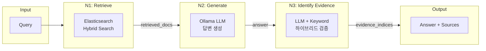
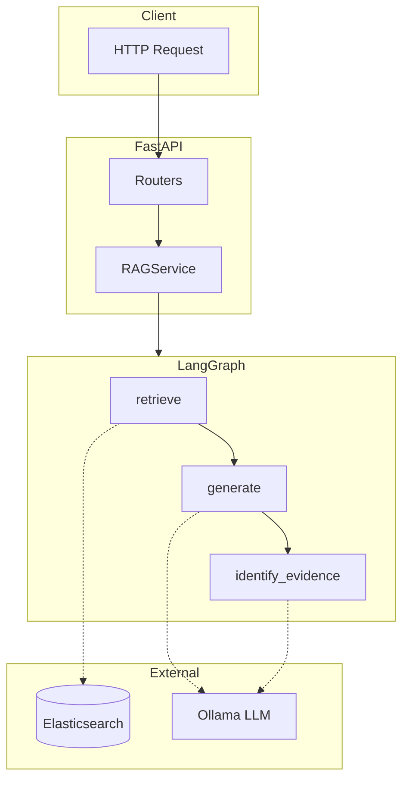
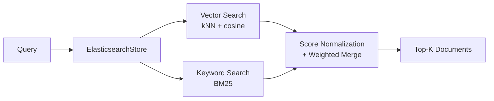

# Multi-turn RAG System

LangGraph 기반 멀티턴 RAG(Retrieval-Augmented Generation) 시스템입니다. Elasticsearch의 하이브리드 검색(Vector + BM25)과 Ollama LLM을 활용하여 한국어 문서에 대한 질의응답을 제공합니다.

## 주요 특징

- **하이브리드 검색**: Vector 유사도 + BM25 키워드 검색 결합
- **멀티턴 대화**: 세션 기반 대화 이력 관리
- **Evidence 추적**: N3 노드의 하이브리드 로직으로 답변 근거 문서 식별
- **비동기 처리**: FastAPI + aiohttp 기반 고성능 비동기 아키텍처

## 아키텍처

### N1-N2-N3 파이프라인



### 시스템 구조



### 하이브리드 검색 Flow



**가중치**: `final_score = (vector_score × 0.5) + (keyword_score × 0.5)`

## 설치 방법

### 사전 요구사항

- Python 3.11+
- Elasticsearch 9.x
- Ollama (또는 원격 Ollama 서버)

### macOS

```bash
# 저장소 클론
git clone https://github.com/your-repo/rag-project.git
cd rag-project
git switch notion-analysis
# 가상환경 생성 및 활성화
python -m venv .venv
source .venv/bin/activate

# 의존성 설치
pip install -r requirements.txt

# 환경 변수 설정
cp .env.sample .env
# .env 파일을 편집하여 설정값 입력

# 서버 실행
cd apps && python main.py
```

### WSL 2 (Windows)

```bash
# WSL 2 Ubuntu 환경에서 실행
sudo apt update && sudo apt install python3.11 python3.11-venv

# 저장소 클론
git clone https://github.com/your-repo/rag-project.git
cd rag-project
git switch notion-analysis
# 가상환경 생성 및 활성화
python3.11 -m venv .venv
source .venv/bin/activate

# 의존성 설치
pip install -r requirements.txt

# 환경 변수 설정
cp .env.sample .env
nano .env  # 설정값 편집

# 서버 실행
cd apps && python main.py
```

## 환경 변수 설정

`.env` 파일에 다음 설정을 추가하세요:

```env
# Elasticsearch
ES_HOST=https://your-elasticsearch-host/
ES_ID=your-api-key-id
ES_API_KEY=your-api-key
ES_INDEX=vector-test-index
VEC_DIMS=1024

# Ollama
OLLAMA_HOST=https://your-ollama-host/
OLLAMA_MODEL=hf.co/LGAI-EXAONE/EXAONE-4.0-1.2B-GGUF:BF16
EMBEDDING_MODEL=bge-m3:latest

# Cloudflare Access (ollama.nabee.ai.kr 사용 시 필수)
CF_ACCESS_CLIENT_ID=your-cf-client-id
CF_ACCESS_CLIENT_SECRET=your-cf-client-secret

# Notion (선택)
NOTION_TOKEN=your-notion-token
NOTION_VERSION=2022-06-28
```

> **Cloudflare Access 설정**
>
> `ollama.nabee.ai.kr`은 Cloudflare Access로 보호되어 있습니다. Service Token을 발급받아 위 두 값을 설정하세요.
> - `CF_ACCESS_CLIENT_ID`: Cloudflare Zero Trust → Access → Service Tokens에서 발급
> - `CF_ACCESS_CLIENT_SECRET`: 발급 시 1회만 표시되므로 즉시 저장 필요
>
> 설정된 헤더는 **Ollama (LLM + Embeddings)** 요청에만 적용됩니다. Elasticsearch(`es.nabee.ai.kr`)는 Cloudflare Access 대상이 아닙니다.

## 사용 방법

### API 엔드포인트

| Method | Endpoint | 설명 |
|--------|----------|------|
| POST | `/query` | 질의응답 (동기) |
| POST | `/query/stream` | 질의응답 (스트리밍) |
| GET | `/health` | 헬스체크 |
| POST | `/document/add` | 문서 추가 |
| POST | `/search` | 검색 |

### 질의 예시

```bash
curl -X POST http://localhost:8000/query \
  -H "Content-Type: application/json" \
  -d '{
    "query": "단일성 정체감 장애를 가진 사람의 특징은?",
    "session_id": "test-session",
    "use_history": false
  }'
```

### 응답 예시

```json
{
  "session_id": "test-session",
  "answer": "단일성 정체감 장애 현상은...",
  "sources": [
    {
      "index": 0,
      "content": "문서 내용...",
      "metadata": {"page_id": "..."},
      "is_evidence": true
    }
  ],
  "processing_time": 5.23
}
```

## 테스트

### 품질 평가 결과 (2026-03-14 기준)

**Phase 1 — 검색 품질**

| 지표 | 결과 | 기준 |
|------|-----:|-----:|
| Hit Rate @3 | **100%** | ≥ 60% |
| Hit Rate @5 | **100%** | ≥ 70% |
| MRR @5 | **1.000** | ≥ 0.40 |

**Phase 2 — 생성 품질 (RAGAS 4개 메트릭)**

| 지표 | 결과 | 기준 |
|------|-----:|-----:|
| Faithfulness | **85.4%** | ≥ 70% |
| AnswerRelevancy | **81.5%** | ≥ 70% |
| ContextPrecision | **92.8%** | ≥ 70% |
| ContextRecall | **96.0%** | ≥ 70% |

> 상세 내용: [`tests/rag_quality_report.md`](tests/rag_quality_report.md)

### 테스트 실행

```bash
# .venv-eval 환경 설정 (최초 1회)
python -m venv .venv-eval
source .venv-eval/bin/activate
pip install -r requirements-eval.txt

# Golden Set 자동 생성 (Ollama gemma3:4b)
python tests/generate_golden_set.py --size 50

# Phase 1: 검색 품질 평가
pytest tests/test_search_quality.py -v

# Phase 2: 생성 품질 평가 (Groq judge)
pytest tests/test_ragas.py::TestRAGAS -v -s

# Phase 2: 생성 품질 평가 (Ollama judge, rate limit 없음)
pytest tests/test_ragas.py::TestRAGASOllama -v -s
```

## 프로젝트 구조

```
rag-project/
├── apps/
│   ├── api.py              # FastAPI 앱 진입점
│   ├── main.py             # 서버 실행
│   ├── common/
│   │   └── config.py       # 설정 관리
│   ├── graphs/
│   │   └── rag_graph.py    # LangGraph 워크플로우
│   ├── models/
│   │   ├── state.py        # GraphState, Document 등
│   │   ├── request.py      # API 요청 모델
│   │   └── response.py     # API 응답 모델
│   ├── prompts/
│   │   ├── chat_prompt.py
│   │   └── get_evidence_prompt.py
│   ├── routers/
│   │   ├── query.py        # 질의응답 라우터
│   │   ├── document.py     # 문서 관리
│   │   └── system.py       # 시스템 헬스체크
│   ├── services/
│   │   └── service.py      # RAGService
│   ├── stores/
│   │   ├── vector_store.py # Elasticsearch 연동
│   │   └── memory_store.py # 세션 이력 관리
│   └── utils/
│       ├── file_processor.py
│       └── notion_connector.py
├── tests/
│   ├── golden_set.json     # 평가용 질문 세트
│   ├── final_report.md     # 테스트 리포트
│   └── user_test_log.md    # API 테스트 로그
├── .env.sample
├── .gitignore
├── requirements.txt
├── CLAUDE.md               # AI 어시스턴트 지침
└── README.md
```

## 기술 스택

| 분류 | 기술 |
|------|------|
| API Framework | FastAPI 0.109.0 |
| Orchestration | LangGraph 0.0.20 |
| Search Engine | Elasticsearch 9.1.5 (하이브리드: kNN + BM25) |
| LLM | Ollama EXAONE-4.0-1.2B |
| Embedding | bge-m3 (1024차원, Ollama) |
| Data Validation | Pydantic v2 |
| 평가 프레임워크 | RAGAS 0.4.3 (4개 메트릭) |
| RAGAS judge | Groq llama-3.3-70b 또는 Ollama gemma3:27b |
| Golden Set 생성 | Ollama gemma3:4b |

## 라이선스

MIT License

## 기여

이슈 및 PR은 언제든 환영합니다.
