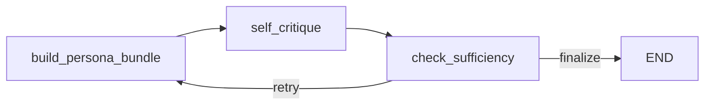

# RAG Project

가볍게 정리한 Persona + Self-RAG 기반 FastAPI RAG 서버입니다.

현재 구현은 검색과 생성 책임을 분리한 뒤, 필요할 때만 한 번 더 검색하는 흐름에 맞춰져 있습니다.

- 검색: Elasticsearch hybrid search
- 생성/판단: Ollama LLM
- 오케스트레이션: LangGraph
- API: FastAPI

## 현재 파이프라인

현재 활성 그래프는 아래 3개 노드로만 구성됩니다.



핵심 흐름:

1. `build_persona_bundle`
2. `self_critique`
3. `check_sufficiency`
4. 필요하면 최대 2회까지 재검색

## 노드 설명

### 1. `build_persona_bundle`

역할:

- 세션 프로필 조회
- 최근 대화 요약 생성
- 검색용 `retrieval_query` 생성
- 생성용 `generation_hints` 생성
- Elasticsearch hybrid search 실행

중요한 점:

- `retrieval_query`에는 검색에 필요한 정보만 넣습니다.
- `generation_hints`에는 답변 스타일과 개인화 힌트만 넣습니다.
- 최근 user 문맥을 검색에 붙일지 여부는 작은 LLM 프롬프트가 판단합니다.

### 2. `self_critique`

역할:

- 검색된 문서만 기반으로 답변 생성
- 현재 문서가 충분한지 평가
- 부족하면 더 나은 `next_query` 생성

출력 JSON:

```json
{
  "answer": "final answer text",
  "is_sufficient": true,
  "utility_score": 4.2,
  "confidence": 0.81,
  "insufficiency_reasons": [],
  "next_query": "better retrieval query if needed"
}
```

### 3. `check_sufficiency`

역할:

- `is_sufficient=true`면 종료
- 아니고 `loop_count < max_loops`면 재검색
- 아니면 종료

기본 설정:

- `SELF_RAG_MAX_LOOPS=2`

## Persona 반영 방식

현재는 과하지 않은 형태로 persona를 사용합니다.

검색 쪽:

- 최근 user 문맥이 필요한 경우에만 `Recent user context:` 추가
- 필요한 경우에만 `Topic hints:` 추가

생성 쪽:

- `response_style`
- `preferred_topics`
- `explicit_notes`

이 정보들은 `generation_hints`로만 들어가며, 검색 질의를 직접 오염시키지 않도록 분리했습니다.

## LLM 사용 위치

현재 활성 파이프라인에서 LLM은 2군데에서 사용됩니다.

1. `context_attachment_prompt`
   최근 user 문맥을 검색 질의에 붙일지 판단
2. `selfrag_critique_prompt`
   답변 생성 + 충분성 판단 + 다음 검색 질의 제안

## 주요 파일

- 그래프: `apps/graphs/rag_graph.py`
- 상태 모델: `apps/models/state.py`
- 서비스 레이어: `apps/services/service.py`
- 질의 API: `apps/routers/query.py`
- attach 판단 프롬프트: `apps/prompts/context_attachment_prompt.py`
- self-rag 프롬프트: `apps/prompts/selfrag_critique_prompt.py`

## API

주요 엔드포인트:

- `POST /query`
- `POST /query/stream`
- `POST /query/feedback`
- `GET /session/{session_id}/profile`
- `GET /session/{session_id}/history`
- `POST /document/add`
- `POST /document/upload`
- `POST /search/vector`
- `POST /search/keyword`
- `POST /search/hybrid`

## 실행

```bash
python -m venv .venv
```

Windows:

```bash
.venv\Scripts\activate
```

macOS/Linux:

```bash
source .venv/bin/activate
```

설치:

```bash
pip install -r requirements.txt
```

서버 실행:

```bash
cd apps
python main.py
```

Swagger:

- `http://localhost:8000/docs`

## 환경 변수

주요 설정:

- `OLLAMA_BASE_URL` 또는 `OLLAMA_HOST`
- `OLLAMA_MODEL`
- `EMBEDDING_MODEL`
- `ELASTICSEARCH_URL` 또는 `ES_HOST`
- `ELASTICSEARCH_INDEX` 또는 `ES_INDEX`
- `ELASTICSEARCH_USER` 또는 `ES_ID`
- `ELASTICSEARCH_PASSWORD` 또는 `ES_API_KEY`
- `SELF_RAG_MAX_LOOPS`
- `TOP_K_RESULTS`

샘플 파일:

- `.env.sample`

## 테스트

현재 회귀 확인에 사용한 테스트:

```bash
pytest tests/test_persona_selfrag_integration.py tests/test_query_api.py
```

## 현재 설계의 의도

이 프로젝트는 복잡한 multi-agent PersonaRAG를 그대로 구현하기보다, 아래 원칙에 맞춘 현실적인 구조를 목표로 합니다.

- 검색용 정보와 생성용 정보를 분리한다.
- follow-up 여부는 고정 규칙보다 LLM이 문맥적으로 판단한다.
- Self-RAG는 가볍게 유지하고, 필요할 때만 재검색한다.
- 외부 API shape는 안정적으로 유지한다.


