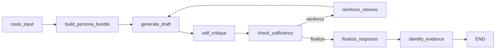

# RAG Project (LangGraph + PersonaRAG + Self-RAG)

이 프로젝트는 `LangGraph` 기반의 멀티턴 RAG 시스템입니다.  
핵심 목표는 다음 두 가지입니다.

- `PersonaRAG` 방식으로 사용자 프로필을 반영한 검색/재랭킹
- `Self-RAG` 방식으로 답변 품질을 자기 비평하고 필요 시 재검색 루프 수행

검색 계층은 `Elasticsearch`(Hybrid: Vector + BM25), 생성 계층은 `Ollama`(EXAONE)를 사용합니다.

## 1. 구현 요약

- `route_input`: 질의 성격(creative/conversational/factual)과 위험도(risk)를 판별해 검색 정책 결정
- `build_persona_bundle`: 세션 프로필 + 최근 대화 요약으로 질의 재작성 및 개인화 재랭킹
- `generate_draft`: Persona 번들 기반 초안 생성
- `self_critique`: Self-RAG 점수(관련성/근거성/유용성) 산출
- `check_sufficiency`: 충분성 판정 후 `reinforce` 또는 `finalize` 분기
- `reinforce_retrieve`: 불충분 사유를 반영해 재검색 쿼리 생성, 루프 반복
- `finalize_response`: 후보 답변 중 최적 응답 선택 + 투명성 메타데이터 생성
- `identify_evidence`: 최종 답변 근거 문서 index 추출

## 2. LangGraph 워크플로우



구현 위치:

- 그래프 정의: `apps/graphs/rag_graph.py`
- 실행 서비스: `apps/services/service.py`
- 상태 모델: `apps/models/state.py`

## 3. PersonaRAG + Self-RAG 반영 포인트

### PersonaRAG 반영

- 사용자 프로필 저장/조회: `apps/stores/memory_store.py`
- 질의 재작성 프롬프트: `apps/prompts/persona_contextual_retrieval_prompt.py`
- 개인화 재랭킹 프롬프트: `apps/prompts/persona_rerank_prompt.py`
- E0 번들(`EvidenceBundleE0`) + M0 풀(`GlobalMessagePoolM0`)을 상태에 유지

### Self-RAG 반영

- 초안 생성: `apps/prompts/selfrag_draft_prompt.py`
- 자기 비평: `apps/prompts/selfrag_critique_prompt.py`
- 재검색 질의 재작성: `apps/prompts/selfrag_rewrite_prompt.py`
- 점수 구조체: `SelfRagScores`  
  (`utility_score`, `avg_isrel`, `full_support_ratio`, `insufficiency_reasons` 등)
- loop 기반 강화 검색: `loop_count`, `max_loops`, `strictness_level` 사용

## 4. 논문-구현 매핑

| 논문 아이디어 | 이 프로젝트 구현 |
|---|---|
| PersonaRAG: 사용자 중심 검색/응답 개인화 | 세션 프로필 + 대화 요약 기반 질의 재작성/재랭킹 |
| PersonaRAG: 멀티 에이전트형 역할 분리 | 라우팅/개인화/생성/비평/근거식별 노드로 역할 분리 |
| Self-RAG: 필요 시점에만 검색 | `route_input` 정책 + `check_sufficiency` 분기 |
| Self-RAG: 자기 비평 후 개선 | `self_critique` -> `reinforce_retrieve` 루프 |
| Self-RAG: 근거성/사실성 강화 | support/relevance/utility 점수 + evidence 식별 |

## 5. API

주요 엔드포인트:

- `POST /query`: 동기 질의
- `POST /query/stream`: SSE 스트리밍 질의
- `POST /query/feedback`: 명시적 사용자 피드백 저장/프로필 반영
- `GET /session/{session_id}/profile`: 세션 사용자 프로필 조회
- `GET /session/{session_id}/history`: 세션 대화 이력 조회
- `POST /document/add`, `POST /document/upload`: 문서 적재
- `POST /search/vector|keyword|hybrid`: 검색 API

## 6. 빠른 실행

```bash
git clone https://github.com/lunnyz3/rag-project.git
cd rag-project
python -m venv .venv
# Windows
.venv\Scripts\activate
# macOS/Linux
# source .venv/bin/activate

pip install -r requirements.txt
cp .env.sample .env
# .env 값 입력 후
cd apps
python main.py
```

서버 실행 후:

- Swagger: `http://localhost:8000/docs`

## 7. 환경 변수

샘플 파일: `.env.sample`

필수 값:

- `ES_HOST`, `ES_INDEX`, `ES_ID`, `ES_API_KEY`
- `OLLAMA_HOST`, `OLLAMA_MODEL`, `EMBEDDING_MODEL`

주요 튜닝 값:

- `SELF_RAG_MAX_LOOPS`
- `MIN_UTILITY`, `MIN_AVG_REL`
- `MAX_NO_SUPPORT_RATIO`, `MAX_PARTIAL_OR_NO_RATIO`
- `MIN_FULL_SUPPORT_RATIO_HIGH_RISK`

## 8. 테스트

```bash
pytest tests/test_persona_selfrag_integration.py
pytest tests/test_search_quality.py
pytest tests/test_generation_quality.py
pytest tests/test_evidence_quality.py
```

## 9. 참고 논문

- PersonaRAG (2024): `PersonaRAG: Enhancing Retrieval-Augmented Generation Systems with User-Centric Agents`  
  https://arxiv.org/abs/2407.09394
- Self-RAG (2023): `SELF-RAG: Learning to Retrieve, Generate, and Critique through Self-Reflection`  
  https://arxiv.org/abs/2310.11511
