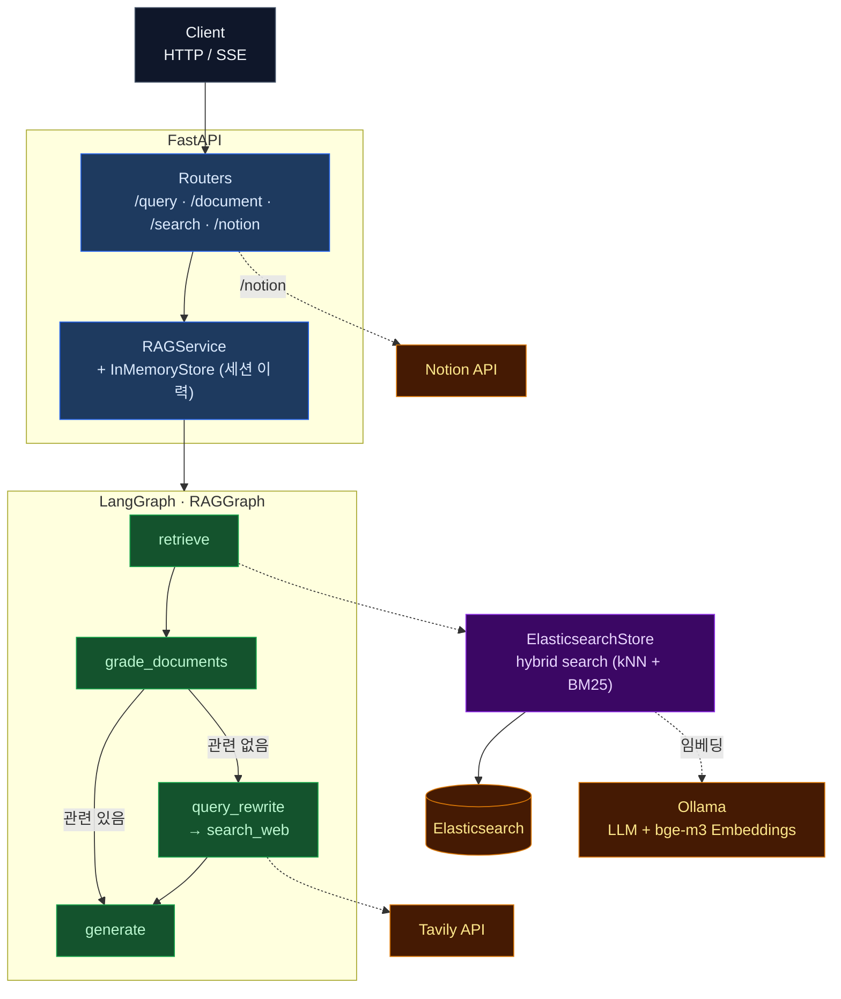
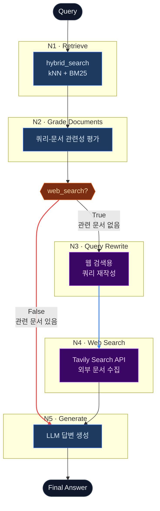
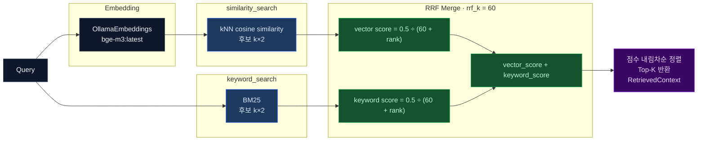

<div align="center">

# LinkMind

**나의 Notion이 나를 아는 개인 AI 지식 베이스**

[](https://python.org)
[](https://fastapi.tiangolo.com)
[](https://github.com/langchain-ai/langgraph)
[](https://elastic.co)
[](LICENSE)

[개요](#-개요) · [주요 기능](#-주요-기능) · [아키텍처](#-아키텍처) · [빠른 시작](#-빠른-시작) · [API 문서](#-api-문서) · [평가 결과](#-평가-결과)

</div>

---

## 개요

LinkMind는 개인 Notion 문서를 기반으로 한 **멀티턴 RAG(Retrieval-Augmented Generation) 시스템**입니다.  
흩어진 노트를 **검색 · 연결 · 요약 가능한 개인 지식 베이스**로 변환합니다.

기존 노트 앱의 한계:

- 노트 간 연결이 없어 정보가 파편화됨
- 과거 기록을 효과적으로 재활용하기 어려움
- 범용 AI는 개인 문맥과 표현을 충분히 반영하지 못함

LinkMind는 사용자의 문서를 기반으로 **맥락 있는 답변**을 생성하는 개인화된 지식 탐색 시스템입니다.

---

## 주요 기능

| 기능 | 설명 |
|------|------|
| **Corrective RAG** | 문서 관련성 평가 후 웹 검색으로 fallback하는 adaptive 파이프라인 |
| **하이브리드 검색** | Vector(kNN + cosine) + BM25 키워드 검색 결합으로 recall 저하 완화 |
| **멀티턴 대화** | 세션 기반 대화 이력 관리로 이전 문맥을 반영한 응답 생성 |
| **스트리밍 응답** | SSE(Server-Sent Events) 기반 실시간 토큰 스트리밍 |
| **비동기 처리** | FastAPI + aiohttp 비동기 파이프라인으로 I/O 병목 최소화 |
| **Notion 연동** | Notion API를 통한 문서 자동 수집 및 인덱싱 |

---

## 아키텍처


### 시스템 구조


```mermaid
flowchart TB
    classDef client fill:#0f172a,stroke:#475569,color:#f1f5f9
    classDef api    fill:#1e3a5f,stroke:#2563eb,color:#dbeafe
    classDef gnode  fill:#14532d,stroke:#16a34a,color:#bbf7d0
    classDef store  fill:#3b0764,stroke:#9333ea,color:#e9d5ff
    classDef ext    fill:#451a03,stroke:#d97706,color:#fde68a

    C["Client\nHTTP / SSE"]:::client

    subgraph API["FastAPI"]
        R["Routers\n/query · /document · /search · /notion"]:::api
        S["RAGService\n+ InMemoryStore (세션 이력)"]:::api
    end

    subgraph G["LangGraph · RAGGraph"]
        direction LR
        G1["retrieve"]:::gnode
        G2["grade_documents"]:::gnode
        G3["query_rewrite\n→ search_web"]:::gnode
        G4["generate"]:::gnode
        G1 --> G2
        G2 -->|관련 없음| G3 --> G4
        G2 -->|관련 있음| G4
    end

    ES["ElasticsearchStore\nhybrid search (kNN + BM25)"]:::store

    ESDB[("Elasticsearch")]:::ext
    OLLAMA["Ollama\nLLM + bge-m3 Embeddings"]:::ext
    TAVILY["Tavily API"]:::ext
    NOTION["Notion API"]:::ext

    C --> R --> S --> G
    G1 -.-> ES --> ESDB
    ES -.->|임베딩| OLLAMA
    G3 -.-> TAVILY
    R -.->|/notion| NOTION
```

### Corrective RAG 파이프라인


```mermaid
flowchart TD
    classDef io       fill:#0f172a,stroke:#334155,color:#f1f5f9,rx:16,ry:16
    classDef process  fill:#1e3a5f,stroke:#2563eb,color:#dbeafe
    classDef decide   fill:#7c2d12,stroke:#ea580c,color:#fed7aa
    classDef web      fill:#3b0764,stroke:#9333ea,color:#e9d5ff

    START(["Query"]):::io

    subgraph SG1["  N1 · Retrieve  "]
        R["hybrid_search\n kNN + BM25"]:::process
    end

    subgraph SG2["  N2 · Grade Documents  "]
        G["쿼리-문서 관련성 평가"]:::process
    end

    DEC{{"web_search?"}}:::decide

    subgraph SG3["  N3 · Query Rewrite  "]
        QR["웹 검색용\n쿼리 재작성"]:::web
    end

    subgraph SG4["  N4 · Web Search  "]
        WS["Tavily Search API\n외부 문서 수집"]:::web
    end

    subgraph SG5["  N5 · Generate  "]
        GEN["LLM 답변 생성"]:::process
    end

    END(["Final Answer"]):::io

    START --> R
    R --> G
    G --> DEC
    DEC -- "True\n관련 문서 없음" --> QR
    DEC -- "False\n관련 문서 있음" --> GEN
    QR --> WS
    WS --> GEN
    GEN --> END

    linkStyle 4 stroke:#ef4444,stroke-width:2px
    linkStyle 5 stroke:#3b82f6,stroke-width:2px
```

### 하이브리드 검색 (RRF)


```mermaid
flowchart LR
    classDef input  fill:#0f172a,stroke:#334155,color:#f1f5f9
    classDef search fill:#1e3a5f,stroke:#2563eb,color:#dbeafe
    classDef merge  fill:#14532d,stroke:#16a34a,color:#bbf7d0
    classDef out    fill:#3b0764,stroke:#9333ea,color:#e9d5ff

    Q["Query"]:::input

    subgraph EMB["Embedding"]
        E["OllamaEmbeddings\nbge-m3:latest\n"]:::input
    end

    subgraph VSEARCH["similarity_search"]
        VS["kNN cosine similarity\n후보 k×2"]:::search
    end

    subgraph KSEARCH["keyword_search"]
        KS["BM25\n후보 k×2"]:::search
    end

    subgraph RRF["RRF Merge  ·  rrf_k = 60"]
        direction TB
        RS1["vector score = 0.5 ÷ (60 + rank)"]:::merge
        RS2["keyword score = 0.5 ÷ (60 + rank)"]:::merge
        RS3["vector_score + keyword_score"]:::merge
        RS1 --> RS3
        RS2 --> RS3
    end

    TOP["점수 내림차순 정렬\nTop-K 반환\nRetrievedContext"]:::out

    Q --> E --> VS
    Q --> KS
    VS --> RS1
    KS --> RS2
    RS3 --> TOP
```

---

## 빠른 시작

### 사전 요구사항

- Python 3.11+
- [uv](https://docs.astral.sh/uv/) (패키지 매니저)
- Elasticsearch 9.x
- Ollama (로컬 또는 원격)

### 설치

```bash
# 저장소 클론
git clone https://github.com/your-repo/notion-rag.git
cd notion-rag

# 의존성 설치
uv sync

# 환경 변수 설정
cp .env.sample .env
```

`.env` 파일을 열어 아래 값을 설정하세요:

```env
# Elasticsearch
ES_HOST=https://your-elasticsearch-host/
ES_ID=your-api-key-id
ES_API_KEY=your-api-key
ES_INDEX=vector-test-index
VEC_DIMS=1024

# Ollama
OLLAMA_HOST=https://your-ollama-host/
OLLAMA_MODEL=hf.co/LGAI-EXAONE/EXAONE-4.0-1.2B-GGUF:BF16
EMBEDDING_MODEL=bge-m3:latest

# Cloudflare Access (원격 Ollama 사용 시)
CF_ACCESS_CLIENT_ID=your-cf-client-id
CF_ACCESS_CLIENT_SECRET=your-cf-client-secret

# Notion (선택)
NOTION_TOKEN=your-notion-token
NOTION_VERSION=2022-06-28
```

### 실행

**1. API 서버**

```bash
cd apps && uv run python main.py
```

서버가 `http://localhost:8000`에서 시작됩니다. API 문서는 `http://localhost:8000/docs`에서 확인할 수 있습니다.

**2. Streamlit UI** (별도 터미널)

```bash
cd apps_fe && uv run streamlit run app.py
```

UI가 `http://localhost:8501`에서 시작됩니다. API 서버(`localhost:8000`)가 먼저 실행 중이어야 합니다.

---

## API 문서

### 엔드포인트

| Method | Endpoint | 설명 |
|--------|----------|------|
| `POST` | `/query` | 질의응답 (동기) |
| `POST` | `/query/stream` | 질의응답 (스트리밍) |
| `GET` | `/health` | 헬스체크 |
| `POST` | `/document/add` | 문서 추가 |
| `POST` | `/search` | 문서 검색 |

### 요청 예시

```bash
curl -X POST http://localhost:8000/query \
  -H "Content-Type: application/json" \
  -d '{
    "query": "단일성 정체감 장애를 가진 사람의 특징은?",
    "session_id": "my-session",
    "use_history": false
  }'
```

### 응답 예시

```json
{
  "session_id": "my-session",
  "answer": "단일성 정체감 장애 현상은...",
  "sources": [
    {
      "index": 0,
      "content": "관련 문서 내용...",
      "metadata": { "page_id": "..." },
      "is_evidence": true
    }
  ],
  "processing_time": 5.23
}
```

---

## 평가 결과

> 평가 기준일: 2026-04-14 · Judge 모델: `gpt-4o-mini` · 데이터셋: `golden_set_138` (138개 쿼리)  
> 상세 리포트: [`tests/ragas_report.md`](tests/ragas_report.md)

### 생성 품질 (RAGAS)

| 지표 | 점수 |
|------|-----:|
| Faithfulness (충실도) | **0.8719** |
| Context Precision (문맥 정밀도) | **0.8901** |
| Context Recall (문맥 재현율) | **0.7654** |
| Answer Relevancy (답변 관련성) | **0.5402** |

### 테스트 실행

```bash
# Golden Set 자동 생성
uv run python tests/generate_golden_set.py --size 50

# Phase 1: 검색 품질 평가
uv run pytest tests/test_search_quality.py -v

# Phase 2: 생성 품질 평가 (Groq judge)
uv run pytest tests/test_ragas.py::TestRAGAS -v -s

# Phase 2: 생성 품질 평가 (Ollama judge)
uv run pytest tests/test_ragas.py::TestRAGASOllama -v -s
```

---

## 프로젝트 구조

```
notion-rag/
├── apps/
│   ├── api.py                  # FastAPI 앱 진입점
│   ├── main.py                 # 서버 실행
│   ├── common/config.py        # 환경 변수 설정
│   ├── graphs/rag_graph.py     # LangGraph 워크플로우
│   ├── models/                 # Pydantic 데이터 모델
│   ├── prompts/                # LangChain 프롬프트 템플릿
│   ├── routers/                # API 라우터
│   ├── services/service.py     # RAGService (비즈니스 로직)
│   ├── stores/
│   │   ├── vector_store.py     # Elasticsearch 연동
│   │   └── memory_store.py     # 세션 이력 관리
│   └── utils/
│       ├── file_processor.py   # PDF/DOCX/MD 파싱
│       └── notion_connector.py # Notion API 연동
├── tests/
│   ├── golden_set.json         # 평가용 질문 세트
│   └── rag_quality_report.md   # 품질 평가 리포트
├── .env.sample
├── pyproject.toml
└── uv.lock
```

---

## 기술 스택

| 분류 | 기술 |
|------|------|
| API Framework | FastAPI 9.3.0 · Uvicorn 2.6.3 |
| Orchestration | LangGraph 0.2.4 · LangChain 2025.9.1 |
| Search Engine | Elasticsearch 9.2.1 (kNN + BM25 하이브리드) |
| Data Validation | Pydantic v2 (21.0.0) |
| 평가 프레임워크 | RAGAS 0.1.0 |
| UI | Streamlit 1.0.0 |

---

## 기여

이슈 및 PR은 언제든 환영합니다. 버그 리포트, 기능 제안, 문서 개선 모두 좋습니다.

## 라이선스

[MIT License](LICENSE)
