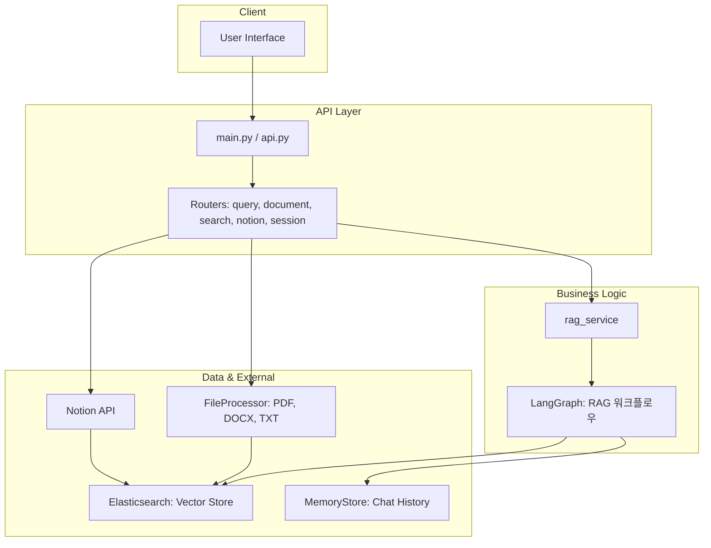
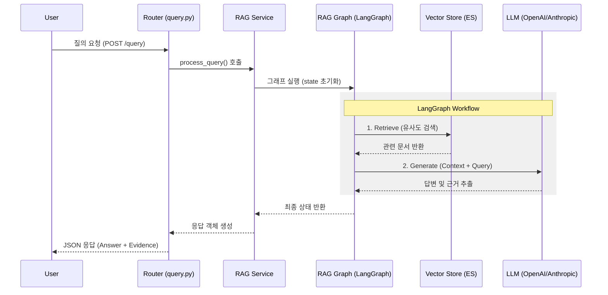

## 전체 아키텍처 다이어그램

```mermaid
graph TD
    subgraph Client
        UI[User Interface]
    end

    subgraph FastAPI_Backend[API Layer]
        Main[main.py / api.py]
        Routers[Routers: query, document, search, notion, session]
    end

    subgraph Service_Layer[Business Logic]
        RAGService[rag_service]
        RAGGraph[LangGraph: RAG 워크플로우]
    end

    subgraph Infrastructure_Layer[Data & External]
        ES[Elasticsearch: Vector Store]
        MS[MemoryStore: Chat History]
        Notion[Notion API]
        FileProc[FileProcessor: PDF, DOCX, TXT]
    end

    UI --> Main
    Main --> Routers
    Routers --> RAGService
    RAGService --> RAGGraph
    RAGGraph --> ES
    RAGGraph --> MS
    Routers --> FileProc
    Routers --> Notion
    FileProc --> ES
    Notion --> ES
```

## 데이터 흐름 다이어그램 (질의 처리 과정)

```mermaid
sequenceDiagram
    participant U as User
    participant R as Router (query.py)
    participant S as RAG Service
    participant G as RAG Graph (LangGraph)
    participant V as Vector Store (ES)
    participant L as LLM (OpenAI/Anthropic)

    U->>R: 질의 요청 (POST /query)
    R->>S: process_query() 호출
    S->>G: 그래프 실행 (state 초기화)
    
    rect rgb(240, 240, 240)
        Note over G, L: LangGraph Workflow
        G->>V: 1. Retrieve (유사도 검색)
        V-->>G: 관련 문서 반환
        G->>L: 2. Generate (Context + Query)
        L-->>G: 답변 및 근거 추출
    end

    G-->>S: 최종 상태 반환
    S-->>R: 응답 객체 생성
    R-->>U: JSON 응답 (Answer + Evidence)
```