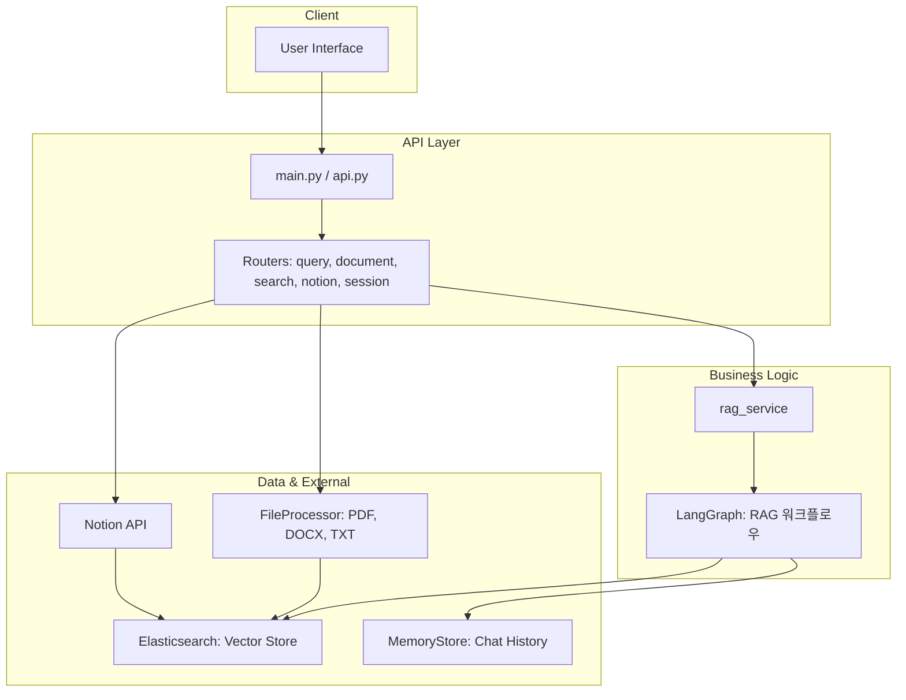
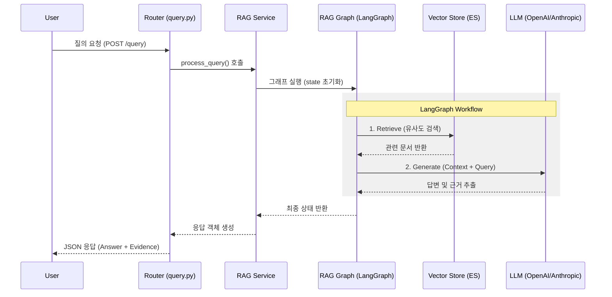

rag_ex 폴더의 소스 코드를 분석한 결과입니다. 이 프로젝트는 FastAPI를 프레임워크로 사용하며, LangGraph를 통해 복잡한 RAG(Retrieval-Augmented Generation) 워크플로우를 제어하는 현대적인 아키텍처를 가지고 있습니다.
## 1. 전체 아키텍처 다이어그램

## 2. 데이터 흐름 다이어그램 (질의 처리 과정)

## 3. 주요 파일 및 디렉토리 역할 요약
| 분류         | 파일/디렉토리                  | 역할 요약                                                                           |
|:-----------|:-------------------------|:--------------------------------------------------------------------------------| 
| EntryPoint | main.py, api.py          | 어플리케이션 실행 및 FastAPI 설정, Lifespan 관리(ES/Service 초기화)                             |
| Routers    | apps/routers/            | API 엔드포인트 정의 (문서 업로드, 질의, 세션 관리, 노션 연동 등)                                       |
| Services   | apps/services/service.py | 비즈니스 로직의 중심. LangGraph를 호출하여 질의를 처리하고 스트리밍 지원                                   |
| Graphs     | apps/graphs/rag_graph.py | 핵심 로직. LangGraph를 사용하여 검색(Retrieve) -> 생성(Generate) 단계를 노드로 정의                  |
| Stores     | apps/stores/             | vector_store.py: Elasticsearch 기반 벡터 검색 및 인덱싱 memory_store.py: 인메모리 대화 이력 관리 |
| Models     | apps/models/             | state.py: LangGraph 상태 정의 request.py/response.py: API 입출력 스키마                |
| Utils      | apps/utils/              | file_processor.py: 다양한 파일(PDF, Docx 등) 파싱 notion_connector.py: Notion API 연동 |
| Prompts    | apps/prompts/            | LLM에 전달할 시스템 프롬프트 및 퓨샷 템플릿 관리                                                   |
| Config     | apps/common/config.py    | 환경 변수 및 시스템 설정(Elasticsearch 주소, 모델 설정 등) 관리                                    |

 ## 4. 특징 및 강점

* **State Management:** LangGraph를 사용하여 대화의 상태(State)를 명확하게 관리하며, 확장이 용이한 구조입니다.

* **Hybrid Search:** ElasticsearchStore 내에서 단순 벡터 검색뿐만 아니라 하이브리드 검색을 고려한 설계가 반영되어 있습니다.

* **Multi-modal Support:** PDF, DOCX 등 다양한 문서 포맷을 처리하여 지식 베이스로 통합할 수 있습니다.

* **Async Architecture:** FastAPI와 httpx 등을 활용한 비동기 처리로 높은 동시성을 확보했습니다.